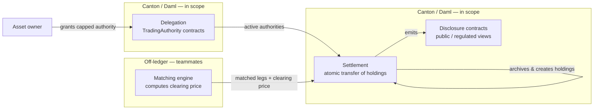

# Master Design Document (MDD)
## Liquidation Auction on Canton

> This MDD covers **only the delegation and settlement modules**.
> Matching is owned by the team and treated here as an external module with a
> fixed input/output contract.

---

## 1. Problem definition & objectives

The project is a **liquidation auction** that runs a few times per day, where
participants trade two assets and matched orders settle atomically on a
Canton ledger. The objective is not to build a full exchange — it is to
demonstrate, end to end, that Canton's privacy and authorization model lets
the same auction expose **three different views to three different audiences**
from a single set of contracts.

The two design constraints that shape everything:

1. **Privacy is the product.** The demo must show, live, that public,
   regulated, and confidential parties see materially different data from the
   same auction.
2. **Authorization is declarative.** Movement of assets on a participant's
   behalf happens through delegated authority expressed as
   signatory/controller roles — never by passing keys or credentials.

The target deliverable is a submission for the **Canton bounty**: Daml
contracts on DevNet, an open-source repo that builds from the README, a
functional UI or CLI that shows party-level visibility differences, and a
demo video switching between party perspectives.

## 2. Scope

**In scope (this MDD):**

- The **delegation** Daml module — standing pre-authorization of the exchange
  by an asset owner, up to a limit.
- The **settlement** Daml module — atomic execution of matched legs on Canton.
- The **privacy model** spanning both, including the disclosure contracts that
  implement the public / regulated / confidential tiers.
- The **Daml Script** test harness that validates each of the above.

**Out of scope:**

- **Matching** — owned by the team (`matching_engine/`). Treated as a black box
  that emits a clearing price and matched legs (see §3, the seam contract).
- **Wallet bridging.** No mechanism moves real ETH or USDC from an external
  chain or exchange into Canton. All participants are assumed already onboarded
  as Canton Parties holding assets natively.
- **Chainlink CRE.** Parked; if added later it attaches to matching, not to the
  modules here.
- **Live Arc / Circle USDC integration.** Deferred; USDC is a native token
  contract placeholder for now.

## 3. System architecture

The system is a three-stage pipeline. Only stages 1 and 3 are Daml and in
scope; stage 2 is off-ledger and external.



**The module seam (matching → settlement).** Matching's only contract with
settlement is a typed list of matched legs plus the clearing price. Settlement
does not know or care how the price was derived. The seam data type is fixed
here so both sides can build in parallel:

```haskell
-- A single leg of a matched trade for one party.
-- delta is signed: positive = party receives, negative = party gives.
data MatchedLeg = MatchedLeg
  with
    party      : Party
    instrument : Text     -- "wETH" | "USDC"
    delta      : Decimal
  deriving (Eq, Show)

-- The full result handed to settlement.
-- Invariant: for every instrument, the sum of deltas across all legs is 0.
data MatchResult = MatchResult
  with
    legs          : [MatchedLeg]
    clearingPrice : Decimal      -- USDC per wETH
    totalVolume   : Decimal      -- in wETH
  deriving (Eq, Show)
```

## 4. Domain model — parties & assets

### Parties

All parties are **stable and long-lived**, allocated once and reused. (Rationale
in §9 / §10: party allocation is topology data and is not currently pruned, so
transient or per-period parties would accumulate permanently.)

| Party        | Role                                                                 |
| ------------ | -------------------------------------------------------------------- |
| `owner`      | A trading participant (retail or fund) who holds and trades assets.  |
| `exchange`   | The auction operator. Acts on owners' behalf via delegated authority. Also wears the transfer-agent / custodian hat for the demo. |
| `regulator`  | A single generic regulator observer (see §6). Identity interchangeable. |
| `publicParty`| A designated observer standing in for "the public tape."             |
| `issuer`     | Issuer of a given token. Exchange-as-issuer placeholder for now; later Arc/Circle for USDC. |
| `auditor`    | Independent auditor. Defined so it exists in the model; not wired to a real auditor. |

### Assets

Two assets, both modeled as the **same native Daml token template**,
distinguished by the `instrument` field. "wETH" is a label only — there is no
real wrap step and no bridge (see §10).

```haskell
template Holding
  with
    issuer     : Party
    owner      : Party
    instrument : Text       -- "wETH" | "USDC"
    amount     : Decimal
  where
    signatory owner         -- owner authorizes movement of their own holding
    observer  issuer        -- issuer can see movements of its token

    -- Transfer is exercised inside the atomic settlement transaction.
    -- It archives this holding and creates a new one for newOwner.
    choice TransferTo : ContractId Holding
      with
        newOwner : Party
      controller owner
      do
        create this with owner = newOwner
```

> **Open authorization detail (resolve at Checkpoint 1, do not assume).**
> `Holding` is modeled with `signatory owner` so that transfers between two
> parties need only those two parties' authority (supplied via their
> `TradingAuthority`, §5). Issuer-controlled *issuance* — how the very first
> holding for a party is minted with correct authority — is deliberately left
> as a skeleton-validation item rather than asserted here, because the exact
> signatory placement for issuance must be proven to compile in a Daml Script
> before it is frozen. Production token standards (CIP-0056) handle issuer
> control differently; we are intentionally simpler for the hackathon.

## 5. Module specification — Delegation

**Responsibility (single, well-defined):** allow an `owner` to grant the
`exchange` bounded authority to move a specific instrument on the owner's
behalf, up to a maximum amount, until revoked. Nothing else.

**Authorization model:** the owner is the `signatory` of the authority
contract. Because of that, when the exchange exercises a choice on it during
settlement, the resulting sub-transaction carries the owner's authority — this
is the standard Daml delegation pattern. No private key is ever passed.

```haskell
template TradingAuthority
  with
    owner     : Party
    exchange  : Party
    instrument: Text        -- the instrument this authority covers
    maxAmount : Decimal      -- standing pre-authorization ceiling
  where
    signatory owner
    observer  exchange

    -- Used by settlement (see §6). Carries owner authority to move a holding.
    -- Returns the new holding contract id, or fails with a defined error
    -- if the amount exceeds the ceiling or the instrument does not match.
    choice UseAuthority : ContractId Holding
      with
        holdingCid : ContractId Holding
        newOwner   : Party
        amount     : Decimal
      controller exchange
      do
        assertMsg "instrument mismatch" (...)      -- defined error state
        assertMsg "exceeds maxAmount"  (amount <= maxAmount)
        exercise holdingCid TransferTo with newOwner

    -- Owner can revoke at any time.
    choice Revoke : ()
      controller owner
      do
        return ()
```

**Input / output contract:**

- Input: `owner : Party`, `exchange : Party`, `instrument : Text`,
  `maxAmount : Decimal`.
- Output: an on-ledger `TradingAuthority` contract, observable by the exchange,
  that settlement can later exercise.

**Deterministic validation (security by design):** `UseAuthority` either
returns a `ContractId Holding` or fails with one of a fixed, named set of
error states (instrument mismatch, amount over ceiling). It never returns an
out-of-range or ambiguous result. This bounds the attack surface: the exchange
cannot use an authority to move more than authorized or a different instrument.

**Skeleton behavior (Checkpoint 1):** the choices exist with these exact
signatures but stub bodies that `debug` their inputs and return a placeholder,
so the privacy/authorization structure can be validated before real logic.

## 6. Module specification — Settlement & privacy

**Responsibility (single, well-defined):** given a `MatchResult` from matching
and the relevant `TradingAuthority` contracts, execute all matched legs as a
single atomic transaction, and emit the disclosure contracts that implement
the visibility tiers.

**Atomicity (atomic delivery-versus-payment):** all legs of a settlement
commit in one Daml transaction or none do. There is no intermediate state in
which one party has given an asset without receiving the other. A failing leg
(e.g. an authority over its ceiling) rolls back the entire settlement. This is
why **no central clearing counterparty is needed** — the settlement-risk window
is zero — and it is a point to highlight in the demo.

```haskell
-- Validation isolated as a pure function with a deterministic result.
data SettlementError
  = LegsDoNotNet
  | MissingAuthority Party
  | AmountOverCeiling Party
  deriving (Eq, Show)

validateBatch : MatchResult -> Either SettlementError ()

-- Entry point exercised by the exchange. Atomic: archives the giving
-- holdings and creates the receiving holdings across all legs in one tx.
template SettlementRequest
  with
    exchange : Party
    result   : MatchResult
  where
    signatory exchange

    choice Execute : ()
      with
        authorities : [ContractId TradingAuthority]
        holdings    : [ContractId Holding]
      controller exchange
      do
        -- 1. validateBatch result  (fail closed on Left)
        -- 2. for each leg, exercise UseAuthority on the matching authority
        --    => all transfers occur atomically under owners' authority
        -- 3. create disclosure contracts (below)
        return ()
```

### Privacy tiers — who sees what, and why

All three tiers are built from the **same mechanism**: `observer` declarations.
Canton is private by default; there is no "anyone on the internet" tier, so
"public" is implemented by adding a designated public observer party.

| Tier             | Contract            | Visible to                              | Contents                                  |
| ---------------- | ------------------- | --------------------------------------- | ----------------------------------------- |
| **Public**       | `AuctionResult`     | `publicParty`, `regulator`, `exchange`  | Clearing price, total volume, timestamp.  |
| **Regulated**    | `SettlementRecord`  | `regulator`, the two counterparties, `exchange` | Full per-leg detail of a settlement. |
| **Confidential** | `Holding` transfers | The two counterparties + `issuer` + `exchange` (as stakeholders of the tx) | Individual positions and balances. |

```haskell
-- Public tape. Aggregate only, no party-level detail.
template AuctionResult
  with
    exchange      : Party
    publicParty   : Party
    regulator     : Party
    clearingPrice : Decimal
    totalVolume   : Decimal
    timestamp     : Time
  where
    signatory exchange
    observer  publicParty, regulator

-- Regulated view. Full leg detail, visible to the regulator (and parties).
template SettlementRecord
  with
    exchange  : Party
    regulator : Party
    parties   : [Party]
    legs      : [MatchedLeg]
  where
    signatory exchange
    observer  regulator, parties
```

**Why this is the demo centerpiece.** Adding a regulator is a *one-line
observer change*. The regulator's identity is interchangeable — what matters is
that visibility is fully determined by which contract a party is made an
observer of. The public party sees the tape but never a leg; a counterparty
sees its own legs but not the other side's confidential holdings; the regulator
sees full leg detail but the public does not. Same auction, three views.

**Regulator framing.** A single generic `regulator` party for now. Named or
multiple regulators (e.g. SEC, FINRA) are introduced as a **future revision**
alongside tokenized-security products — see §11. No legal or jurisdictional
claim is made by this document (this is not legal advice).

**Historical/regulatory queries** belong in the Participant Query Store (PQS),
which keeps a distilled history separate from the active ledger — the natural
home for the regulated tier's past-trade lookups without bloating active state.

## 7. Build plan — checkpoints

Work proceeds **one checkpoint at a time**. Each checkpoint is built, checked
with a Daml Script, and committed to GitHub before the next begins. The repo
must build and run from the README at every commit (open-source bounty
requirement).

| # | Checkpoint            | Build                                                                 | Check (Daml Script)                                                                                  | Done = commit when…                                            |
| - | --------------------- | --------------------------------------------------------------------- | ---------------------------------------------------------------------------------------------------- | -------------------------------------------------------------- |
| 1 | **Skeleton / empty framework** | All templates & choices with real signatures, stub bodies that `debug` inputs. Deploy to DevNet via Seaport. | Allocate all parties; create stub contracts; exercise stub choices; query as each party and assert the **privacy tiers** hold. | Deploy succeeds and visibility assertions pass on stubs.       |
| 2 | **Delegation logic**  | Real `TradingAuthority` (UseAuthority ceiling/instrument checks, Revoke). | Create authority; assert owner=signatory, exchange=observer; test over-ceiling rejection; test revoke. | All delegation validations pass; over-limit fails closed.      |
| 3 | **Settlement logic**  | Real `Execute` + `validateBatch`; emits `AuctionResult` + `SettlementRecord`. | Run a full atomic swap; assert balances; assert a failing leg rolls back **all** legs; re-assert tiers. | Atomic swap correct; rollback verified; tiers verified on real data. |

## 8. Testing protocol (autonomous diagnostics)

- **Mock harness:** Daml Script is the mock environment. It allocates parties,
  seeds `Holding` contracts (the "already onboarded" assumption), and feeds
  hand-crafted `MatchResult` values in place of the real matching engine.
- **Simulated inputs:** maintain a small fixture set of `MatchResult` cases —
  a clean two-party swap, an over-ceiling leg, a non-netting batch, a revoked
  authority — so settlement's error states are all exercised.
- **Self-correction:** because each module returns a well-defined result or a
  named error, failures surface as deterministic script assertions rather than
  runtime ambiguity, so they can be diagnosed and fixed locally without manual
  poking at a live ledger.

## 9. Modularity & security principles

- **Strict boundaries.** Delegation and settlement are isolated units. Their
  only contract with matching is the `MatchResult` seam type in §3; their only
  contract with each other is the `TradingAuthority` consumed by `Execute`.
- **Deterministic validation.** Every choice returns a defined type or fails
  with a named error from a closed set. No out-of-range or ambiguous returns.
- **Security by design.** The authorization ceiling (`maxAmount`), the
  instrument check, and the netting invariant constrain what the exchange can
  do with delegated authority. Tight, typed boundaries are the security model —
  there is no path for the exchange to move more than authorized.

## 10. Known limitations

- **No bridging.** Real ETH/USDC cannot be moved onto Canton by this system.
  Participants are assumed pre-onboarded with native holdings. "wETH" is a
  label on a native token, not a wrapped asset.
- **Issuance authority** for the first mint of a holding is a Checkpoint-1
  validation item, not yet frozen (see §4 note).
- **Matching is external** and assumed correct; this MDD does not specify the
  pricing algorithm.
- **Pruning is the validator operator's concern.** The model is verified
  (active contracts persist; archived contracts and history are prunable;
  topology/parties are not currently pruned), but specific retention/schedule
  numbers are operator/config-dependent and are intentionally **not** specified
  here.
- **Regulator identity is notional.** No legal/jurisdiction claim; the demo
  shows the mechanism, not compliance with any specific regime.

## 11. Deferred / future revisions

Each of these requires a formal Revision Log entry before work begins:

- Chainlink CRE as an orchestration layer over matching.
- Live Arc blockchain + Circle USDC issuance integration.
- Tokenized-security products and, with them, named/multiple regulators
  (e.g. SEC, FINRA) as the visibility set expands.
- Issuer-controlled issuance aligned with the CIP-0056 token standard.

## 12. References

- Canton for ETH developers — https://docs.canton.network/appdev/modules/m2-canton-for-ethereum-devs
- Pruning reference — https://docs.canton.network/overview/reference/pruning
- Token standard (CIP-0056) — https://docs.canton.network/overview/reference/cip-0056
- Canton developer hub — https://dev-hub.canton.foundation
- Seaport deployment guide — https://github.com/Jatinp26/Seaport-Guide

---

> Daml code snippets above are **design-level signatures**, not verified to
> compile. Checkpoint 1 exists precisely to validate the authorization and
> privacy structure in a Daml Script before any logic is frozen.
